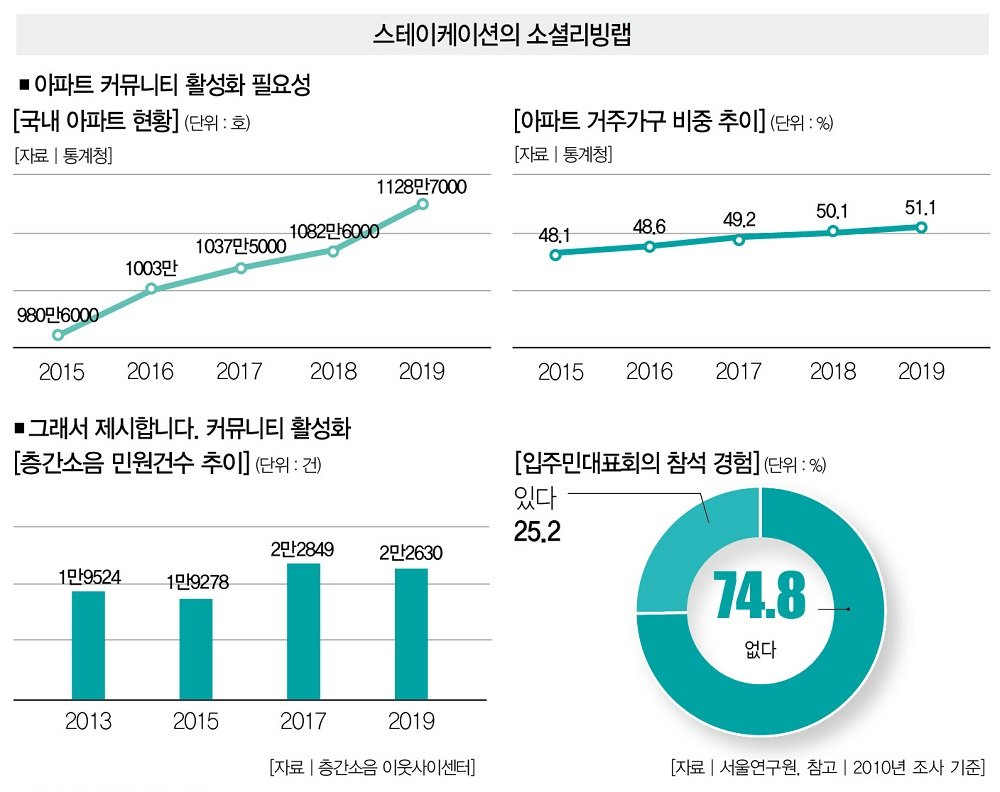

# 앞집 (APT ZIP)

아파트 중심 무료 커뮤니티 서비스

사람 사는 곳에서는 마찰이 있기 마련입니다.
제가 사는 아파트는 피켓 들고 시위도 하시고, 전에 계시던 관리소장님은 해고를 당하셨습니다.
[2019 인구주택총조사](http://kostat.go.kr/portal/korea/kor_nw/1/2/2/index.board?bmode=read&bSeq=&aSeq=384690&pageNo=1&rowNum=10&navCount=10&currPg=&searchInfo=srch&sTarget=title&sTxt=2019)에 따르면 우리나라의 전체 가구 수 대비 아파트 가구 수는 51.1%에 달합니다.
이 비율이 상승할수록 아파트 주민 간 소통의 중요성은 늘어나고 있습니다.


_출처: [아파트 갈등 해결책 "오늘도 눈인사 하셨나요? 그거예요" - 더스쿠프](https://m.post.naver.com/viewer/postView.nhn?volumeNo=29654178&memberNo=12494964)_

하지만 좁은 아파트 단지에서 괜히 껄끄러운 관계를 만들고 싶지 않은 분들도 많습니다.
제가 느끼기엔 소통이 완전히 단절된 느낌입니다.
흉흉한 뉴스들도 한몫했습니다.
그래서 불편한 일이 있더라도 마음에만 담아두고 나중에 조용히 이사를 가죠.
아파트에서 말할 수 있는 창구가 있는 것도 아닙니다.
기존 아파트 커뮤니티 서비스들은 각종 부가 서비스를 포함해서 유료로 판매하고요.

그래서 처음에 아파트 단지 주민이라는 인증만 거친다면
누구나 익명으로 참여할 수 있는 아파트 중심의 커뮤니티 서비스를 만들고 싶었습니다.
바로 앞집(APT ZIP) 입니다.

## 시작하기

### 도커 환경

- 먼저 MySQL 컨테이너를 생성합니다.

> 아파트 데이터(18010 레코드)를 삽입하는 데 대략 2분 20초가 소요됩니다.

```bash
docker run \
--name aptzip-mysql \
--publish 13306:3306 \
--detach \
--restart=always \
--env MYSQL_ROOT_PASSWORD=testmaria \
--env TZ=Asia/Seoul \
--volume /$PWD/aio/mysql/docker-entrypoint-initdb.d/:/docker-entrypoint-initdb.d/ \
--volume /$PWD/aio/mysql/my.cnf:/etc/mysql/conf.d/aptzip.cnf,ro \
mysql:8.0.23

# /docker-entrypoint-initdb.d/의 모든 init 스크립트가 실행될 때까지 기다립니다.
docker logs -f aptzip-mysql
```

- 앞집 서버를 실행합니다.

```bash
npm run start
```

## API

- [docs/api](aio/docs/api.md)

## 테스트 데이터

- init 스크립트에 포함되어 있는 테스트 데이터입니다.

| APT No. | Username | Password |
| ------- | -------- | -------- |
| 1       | admin1   | pass1    |
| 1       | user11   | pass11   |
| 1       | user12   | pass12   |
| 2       | admin2   | pass2    |
| 2       | user21   | pass21   |
| 2       | user22   | pass22   |
| 3       | admin3   | pass3    |
| 3       | user31   | pass31   |
| 3       | user32   | pass32   |

## 아파트 단지 데이터셋 출처

- [공공데이터포털 데이터셋: 국토교통부 공동주택관리정보시스템](https://www.data.go.kr/data/15073271/fileData.do)
- [공공데이터포털 오픈API: 국토교통부 공동주택 단지 목록제공 서비스](https://www.data.go.kr/data/15057332/openapi.do)

## 라이센스

- MIT
