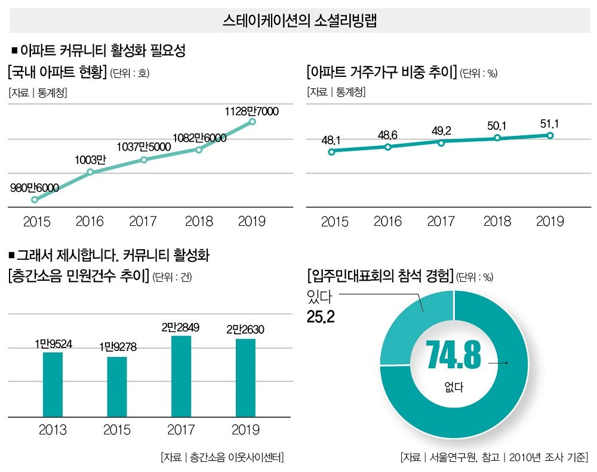

# 동기

사람 사는 곳에서는 마찰이 있기 마련입니다.
제가 사는 아파트는 피켓 들고 시위도 하시고, 전에 계시던 관리소장님은 해고를 당하셨습니다.
[2019 인구주택총조사](http://kostat.go.kr/portal/korea/kor_nw/1/2/2/index.board?bmode=read&bSeq=&aSeq=384690&pageNo=1&rowNum=10&navCount=10&currPg=&searchInfo=srch&sTarget=title&sTxt=2019)에 따르면 우리나라의 전체 가구 수 대비 아파트 가구 수는 51.1%에 달합니다.
이 비율이 상승할수록 아파트 주민 간 소통의 중요성은 늘어나고 있습니다.

_출처: [아파트 갈등 해결책 "오늘도 눈인사 하셨나요? 그거예요" - 더스쿠프](https://m.post.naver.com/viewer/postView.nhn?volumeNo=29654178&memberNo=12494964)_

하지만 좁은 아파트 단지에서 괜히 껄끄러운 관계를 만들고 싶지 않은 분들도 많습니다.
제가 느끼기엔 소통이 완전히 단절된 느낌입니다.
흉흉한 뉴스들도 한몫했습니다.
그래서 불편한 일이 있더라도 마음에만 담아두고 조용히 이사를 갑니다.
아파트에서 말할 수 있는 창구가 있는 것도 아닙니다.
기존 아파트 커뮤니티 서비스들은 각종 부가 서비스를 포함해서 유료로만 판매되고 있습니다.

그래서 처음에 아파트 단지 주민이라는 인증만 거친다면
누구나 익명으로 참여할 수 있는 아파트 중심의 커뮤니티 서비스를 만들고 싶었습니다.
