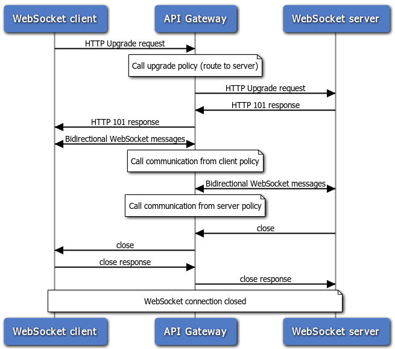
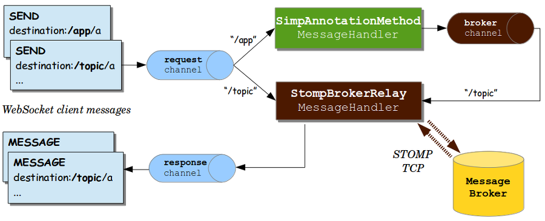

# Web Socket 알게 된 것들

[spring guide](https://spring.io/guides/gs/messaging-stomp-websocket/) 
[Spring stomp와 SockJs를 통한 웹소켓 구현하기, 그리고 장,단점](https://postitforhooney.tistory.com/entry/SpringStomp-Spring-stomp%EC%99%80-Socjks%EB%A5%BC-%ED%86%B5%ED%95%9C-%EC%9B%B9%EC%86%8C%EC%BC%93-%EA%B5%AC%ED%98%84%ED%95%98%EA%B8%B0-%EA%B7%B8%EB%A6%AC%EA%B3%A0-%EC%9E%A5%EB%8B%A8%EC%A0%90) 
[Spring websocket chatting server](https://daddyprogrammer.org/post/4077/spring-websocket-chatting/) : Stateless 적용을 위한 JWT 도입 
[webSocket으로 개발하기 전에 알고 있어야 할 것들](https://adrenal.tistory.com/20)
[웹 소켓을 활용한 쪽지 알람 기능](https://simsimjae.tistory.com/25)
[WebSocket과 STOMP 연동](https://wondongho.tistory.com/73)
[Spring WebSocket 소개](https://supawer0728.github.io/2018/03/30/spring-websocket/
)

>## 1. 개념

 
 
웹 소켓은 가장 성공적인 http 프로콜을 기반으로 하지만, http프로토콜과는 전혀 다른 프로콜이라고 생각하면 좋을것 같습니다. 특히, 기존 http프로콜은 연결-요청-응답-종료 반복된 작업을 계속 하는 문제가 발생됩니다. Websocket은 이를 해결하기 위해 나온 기술 중 하나이며, 2014년 표준으로 채택되어 HTML5에서 Websocket protocol이 추가가 되었습니다. 

웹소켓은 http를 통해 연결요청을 전달합니다. 이러한 과정을 handshake라고 하며, http를 Websocket 프로토콜로 바꾸는 Protocol switching 작업을 진행합니다. 이 과정을 통해 새로운 소켓이 만들어지고, 이 소켓을 통해 양방향 통신이 가능하게 되는 것입니다. 기존의 연결되고, 종료되는 부분이 1번으로 줄어지게 되는 것이며, 그 연결하는 과정 속에서 전달되는 기본 Header(Encoding, charset, text, cookie 등)정보를 줄일 수 있는 장점이 생깁니다.

 

 

>## 2. 네트워크 오버헤드 비교

***
폴링(Polling) 방식

요청/응답 헤더 데이터 용량: (871 Byte)
- 1000명 *  헤더 데이터 용량  = 871,000  Byte
- 10000명 *  헤더 데이터 용량  = 8,710,000  Byte
- 100000명 *  헤더 데이터 용량  = 87,100,000 Byte

***
WebSocket 방식

메시지 데이터 용량: (2 Byte)
- 1000명 *   메시지 데이터 용량   = 2,000  Byte
- 10000명 *   메시지 데이터 용량   = 20,000  Byte
- 100000명 *   메시지 데이터 용량   = 200,000 Byte

>## 3. Socket.io, SockJS, STOMP
1. Socket.io : Node.js 모듈. 클라이언트, 서버 모두 JS로 개발.
1. WebSocket : 표준 웹소켓. IE10부터 적용.
  - TextWebSocketHandler / BinaryWebSocketHandler 구현 필요
1. SockJS : IE8부터 적용.
1. STOMP : Topic 구독 방식. Spring 지원. 서버 부하 적음.
  - TextWebSocketHandler / BinaryWebSocketHandler 구현 필요없음
  - heart-beat
  - @MessageMapping
  - @SendTo
  - @SendToUser
  - SimpMessagingTemplate.convertAndSendToUser()
  - MessagesSupplier

# To-Do
- Interceptor 결합?
- Handler와의 차이
- Web Hook 개념